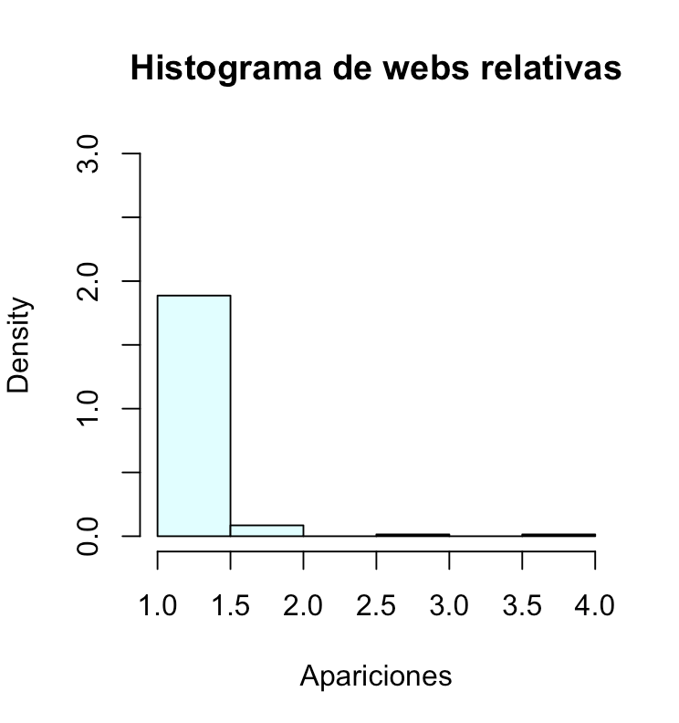
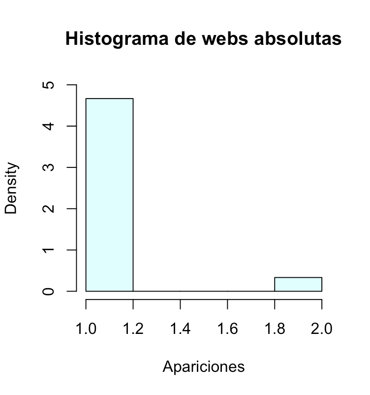
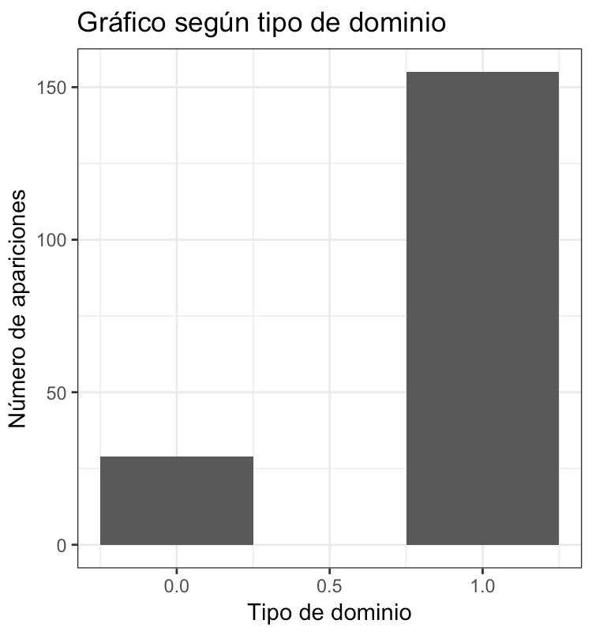
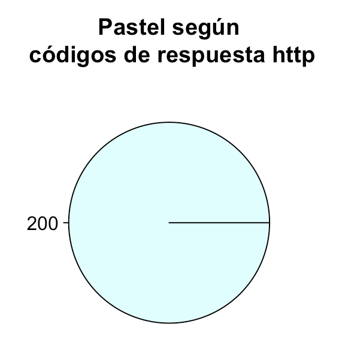

```{r setup, include=FALSE}
knitr::opts_chunk$set(echo = TRUE)
```

# Soluciones del laboratorio 3

Documento Markdown R con las soluciones del laboratorio 3 para la asignatura de Data Driven Security del Máster en CyberSecurity Management.

## Crawling y Scrapping

### 1.1 Obtención de la página web

En este apartado se asigna la url a una variable *my_url* para poder acceder a ella más cómodamente en un futuro. Además se hace uso de la función *read_html()* para obtener la web.

```{r, eval=FALSE}
library("httr")
my_url <- "https://www.mediawiki.org/wiki/MediaWiki"
webpage <- read_html(my_url)
```


### 1.2 Analisis de el contenido de la web

Una vez obtenida la web, podemos pasar a analizarla. Por ejemplo, podemos hacer uso del comando *html_nodes("title")* o *html_nodes("head")*, que nos devolvería el título y el encabezado de la web, respectivamente.

```{r, eval=FALSE}
webpage %>% html_nodes("title")
webpage %>% html_nodes("head")
```


### 1.3.	Extracción de enlaces

Para la extracción de todas las urls de la web, es necesario percatarse de que las urls se encuentran siempre precedidas por *href* y *a*. Así pues, la búsqueda se ha de hacer en base a esos parámetros.

Las urls encontradas las guardamos en la variable *urls*.

```{r, eval=FALSE}
urls <- webpage %>% html_nodes("a") %>% html_attr("href")
```


### 1.4 Exploración de enlaces

Una vez que se han obtenido los enlaces y sabiendo que posteriormente se van a realizar gráficas en base a si son rutas absolutas o relativas, procedemos a la separación y agrupación de los enlaces.

Además, cabe destacar que en este punto también hacemos la consulta para conocer el código de respuesta de la web, con la función *status_code*.

Entre una búsqueda y otra, se dejan pasar 5 segundos gracias a la función *Sys.sleep(5)*.

```{r, eval=FALSE}
url_mediawiki <- "https://www.mediawiki.org/"

status <- c()
webs_con <- c()
webs_sin <- c()
webs_con_solo <-c()
webs_sin_solo <-c()

for (i in 1:length(urls)){
    if (is.na(urls[i])) {
    } else if (grepl("http", urls[i])) {
      webs_con <- c(webs_con, urls[i])
      webs_con_solo <- c(webs_con_solo, urls[i])
      webs_sin <- c(webs_sin, urls[i])
      status <- c(status, status_code(GET(urls[i])))
    } else if (!grepl("http", urls[i])) {
      webs_sin_solo <- c(webs_sin_solo, urls[i])
      if (grepl("//", urls[i])) {
        webs_con <- c(webs_con, paste("https:",urls[i], sep = ""))
        webs_sin <- c(webs_sin, urls[i])
        status <- c(status, status_code(GET(paste("https:",urls[i], sep = ""))))
      } else {
        webs_con <- c(webs_con, paste(url_mediawiki,urls[i], sep = ""))
        webs_sin <- c(webs_sin, urls[i])
        status <- c(status, status_code(GET(paste(url_mediawiki,urls[i], sep = ""))))
      }
    }  else {
    }
    Sys.sleep(5)
}
```

### Gráficos en R

### 2.1	Histograma

A continuación, se procede a la creación de dos histogramas disjuntos en base a los resultados obtenidos de las urls: por un lado, vamos a agrupar los relativos a los enlaces relativos y por otro lado a los enlaces absolutos. Se puede obervar para ambos casos que lo más usual es que los enlaces sólo aparezcan una vez. Sin embargo, también hay enlaces que aparecen dos o más veces.

```{r, eval=FALSE}
# Histograma relativo
df_sin <- data.frame(webs_sin_solo)
new_df_sin<-aggregate(df_sin$webs_sin_solo, df_sin, length)

transformacion <-c()
for (i in 1:nrow(new_df_sin[2])){
  transformacion <- c(transformacion,as.numeric(new_df_sin[i,2]))
}

hist(transformacion,freq=FALSE,col="lightcyan", ylim=c(0,3),main="Histograma de webs relativas",xlab="Apariciones")

```

```{r, out.width = "300px", echo=FALSE}

```

```{r, eval=FALSE}
# Histograma absoluto
df_con <- data.frame(webs_con_solo)
new_df_con <- aggregate(df_con$webs_con_solo, df_con, length)

transformacion <- c()
for (i in 1:nrow(new_df_con[2])){
  transformacion <- c(transformacion,as.numeric(new_df_con[i,2]))
}

hist(transformacion,freq=FALSE,col="lightcyan", ylim=c(0,5), xlim=c(1,2), main="Histograma de webs absolutas",xlab="Apariciones")
```

```{r, out.width = "300px", echo=FALSE}

```

### 2.2	Un gráfico de barras

En este apartado se puede obervar un gráfico de barras que contiene el número de apariciones total, dividido en enlaces absolutos (valor 0) y enlaces relativos (valor 1).

```{r, eval=FALSE}
dentro <- c()
for (i in 1:length(webs_sin)){
  if (grepl("http", webs_sin[i])) {
    if (grepl("https://www.mediawiki.org", webs_sin[i])) {
      dentro <- c(dentro, 1)
    }
    else {
      dentro <- c(dentro, 0)
    }
  } else if (!grepl("http", webs_sin[i])) {
    dentro <- c(dentro, 1)
  }
}

df_dentro <- data.frame(dentro)
new_df_dentro <- aggregate(df_dentro$dentro, df_dentro, length)

ggplot(data = new_df_dentro, aes(x = dentro, y = x)) + geom_bar(stat = "identity", width = 0.5) + ylab("Número de apariciones") + xlab("Tipo de dominio") + ggtitle("Gráfico según tipo de dominio") + theme_bw()
```

```{r, out.width = "300px", echo=FALSE}

```

### 2.3 Pie Chart

En último lugar, esta representación en forma de tarta muestra los códigos de respuesta de la petición http a cada uno de los enlaces. Como se puede ver, para todos los casos el código es 200 (éxito).

```{r, eval=FALSE}
df_codigo <- data.frame(status)
new_df_codigo <- aggregate(df_codigo$status, df_codigo, length)
new_df_codigo

pie(table(new_df_codigo$status), main = "Pastel según\n códigos de respuesta http", col = "lightcyan")
```

```{r, out.width = "300px", echo=FALSE}

```

# Tiempo dedicado

El tiempo total de dedicación a la resolución de este laboratorio, en el que se incluyen el tiempo de comprensión del ejercicio, búsqueda de información, investigación de librerías, programación y ejecución de comandos y redacción del documento, ha sido de: **8 horas**.